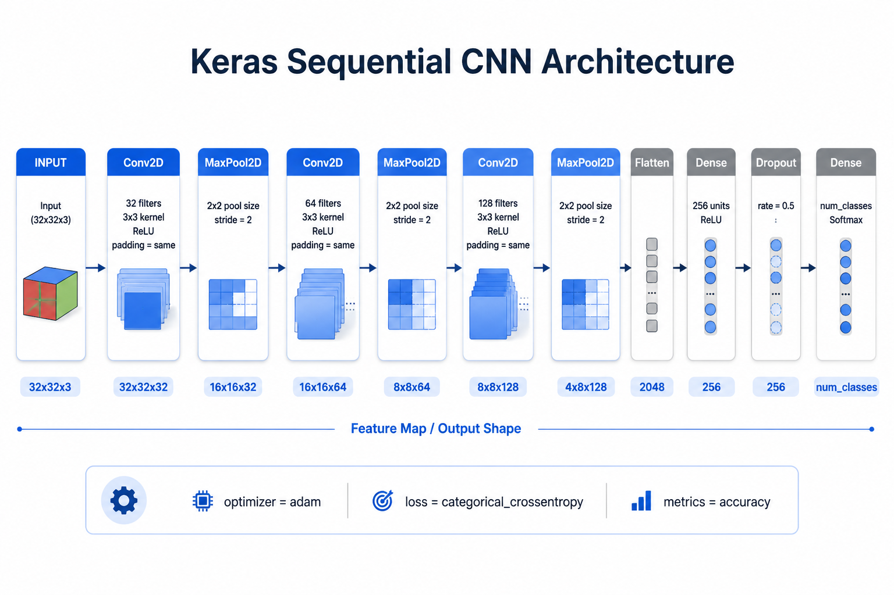

# Traffic Sign Classification using CNN

This project implements a Convolutional Neural Network (CNN) to classify traffic signs using TensorFlow and Keras.

## Dataset
The model is trained on the **German Traffic Sign Recognition Benchmark (GTSRB)** dataset.
* **Classes:** 43 different traffic sign classes.
* **Structure:** Contains `Train`, `Test`, and `Meta` folders.

## Dependencies
Ensure you have the following libraries installed before running the project:
pip install numpy pandas matplotlib pillow scikit-learn tensorflow keras

## Preprocessing
Before feeding the images into the neural network, the following preprocessing steps are applied:
* **Resizing:** All images are resized to `30 × 30` pixels.
* **Grayscale:** Images are converted to grayscale.
* **Normalization:** Pixel values are scaled to the range `[0, 1]` by dividing by 255.
* **Label Encoding:** Labels are one-hot encoded using Keras' `to_categorical`.

## Usage
1. Download and extract the GTSRB dataset into the notebook's directory.
2. Open `task1.ipynb` in Jupyter Notebook.
3. Execute the cells sequentially.

## CNN Architecture & Model

<!-- جایگذاری عکس مدل -->
 
*(Note: Replace `images/model_architecture.png` with the actual path to your model's image)*

The CNN model takes an input of shape `30 × 30 × 1` and consists of the following layers:

* **Block 1:**
  * Conv2D (32 filters, `5 × 5` kernel)
  * Conv2D (32 filters, `5 × 5` kernel)
  * MaxPooling2D (`2 × 2` pool size)
  * Dropout (0.25)
* **Block 2:**
  * Conv2D (64 filters, `3 × 3` kernel)
  * Conv2D (64 filters, `3 × 3` kernel)
  * MaxPooling2D (`2 × 2` pool size)
  * Dropout (0.25)
* **Classifier:**
  * Flatten
  * Dense (256 units, ReLU activation)
  * Dropout (0.5)
  * Output Dense (43 units, Softmax activation)

### Model Summary
* **Convolutional Layers Parameters:** 832; 25,632; 18,496; 36,928
* **Dense Layers Parameters:** 147,712; 11,051
* **Total / Trainable Parameters:** 240,651
* **Non-trainable Parameters:** 0

## Training Configuration
* **Optimizer:** Adam
* **Loss Function:** Categorical Crossentropy
* **Metrics:** Accuracy
* **Epochs:** 15
* **Batch Size:** 32
* **Data Split:** 80% Training / 20% Validation

## Results
The model achieved the following accuracy scores:
* **Training Accuracy:** ~99.0%
* **Validation Accuracy:** ~97.8%
* **Test Accuracy:** ~95.2% (measured using `scikit-learn`'s `accuracy_score`)

The learning curves indicate effective learning and generalization without significant overfitting.

کافیست این متن را کپی کرده و در یک فایل با نام `README.md` در پروژه خود ذخیره کنید. برای نمایش عکس در بخش مدل، فقط باید مسیر `images/model_architecture.png` را به آدرس عکسی که می‌خواهید قرار دهید، تغییر دهید.
