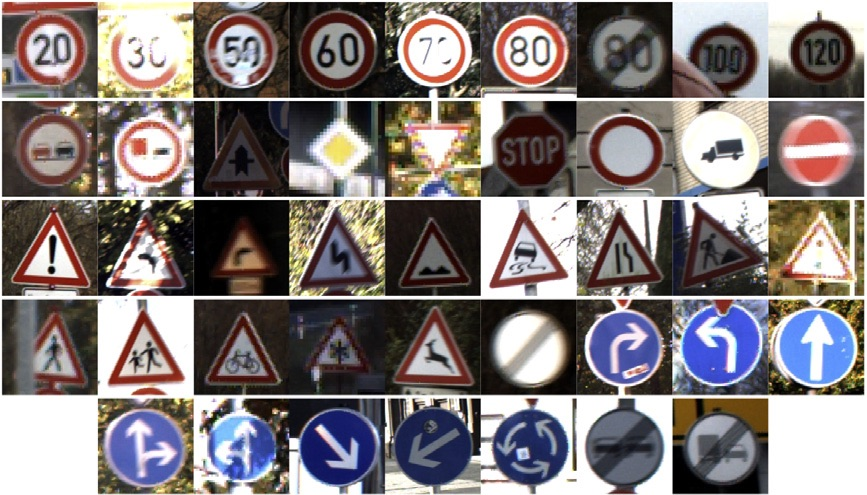

# Traffic Sign Classification using CNN

This project implements a Convolutional Neural Network (CNN) to classify traffic signs using TensorFlow and Keras.

## Dataset
The model is trained on the **German Traffic Sign Recognition Benchmark (GTSRB)** dataset.
* **Classes:** 43 different traffic sign classes.
* **Structure:** Contains `Train`, `Test`, and `Meta` folders.

## Dependencies
Ensure you have the following libraries installed before running the project:
pip install numpy pandas matplotlib pillow scikit-learn tensorflow keras

## Preprocessing
Before feeding the images into the neural network, the following preprocessing steps are applied:
* **Resizing:** All images are resized to `32 × 32` pixels.
* **Grayscale:** Images are converted to grayscale.
* **Normalization:** Pixel values are scaled to the range `[0, 1]` by dividing by 255.
* **Label Encoding:** Labels are one-hot encoded using Keras' `to_categorical`.

## Usage
1. Download and extract the GTSRB dataset into the notebook's directory.
2. Open `traffic sign classifier.ipynb` in Jupyter Notebook.
3. Execute the cells sequentially.

## CNN Architecture & Model

 
*(Note: Replace `images/model_architecture.png` with the actual path to your model's image)*
The CNN model takes an input of shape `32 × 32 × 3` and consists of the following layers:
* **Block 1:**
  * Conv2D (32 filters, `3 × 3` kernel, same padding) — Output: `(None, 32, 32, 32)`
  * MaxPooling2D (`2 × 2` pool size) — Output: `(None, 16, 16, 32)`
* **Block 2:**
  * Conv2D (64 filters, `3 × 3` kernel, same padding) — Output: `(None, 16, 16, 64)`
  * MaxPooling2D (`2 × 2` pool size) — Output: `(None, 8, 8, 64)`
* **Block 3:**
  * Conv2D (128 filters, `3 × 3` kernel, same padding) — Output: `(None, 8, 8, 128)`
  * MaxPooling2D (`2 × 2` pool size) — Output: `(None, 4, 4, 128)`
* **Classifier:**
  * Flatten — Output: `(None, 2048)`
  * Dense (256 units) — Output: `(None, 256)`
  * Dropout
  * Output Dense (43 units, Softmax activation) — Output: `(None, 43)`

### Model Summary

| Layer (type) | Output Shape | Param # |
| :--- | :--- | :--- |
| **conv2d_12** (Conv2D) | `(None, 32, 32, 32)` | 896 |
| **max_pooling2d_12** (MaxPooling2D) | `(None, 16, 16, 32)` | 0 |
| **conv2d_13** (Conv2D) | `(None, 16, 16, 64)` | 18,496 |
| **max_pooling2d_13** (MaxPooling2D) | `(None, 8, 8, 64)` | 0 |
| **conv2d_14** (Conv2D) | `(None, 8, 8, 128)` | 73,856 |
| **max_pooling2d_14** (MaxPooling2D) | `(None, 4, 4, 128)` | 0 |
| **flatten_4** (Flatten) | `(None, 2048)` | 0 |
| **dense_8** (Dense) | `(None, 256)` | 524,544 |
| **dropout_4** (Dropout) | `(None, 256)` | 0 |
| **dense_9** (Dense) | `(None, 43)` | 11,051 |

* **Convolutional Layers Parameters:** 896 + 18,496 + 73,856 = 93,248  
* **Dense Layers Parameters:** 524,544 + 11,051 = 535,595  
* **Total / Trainable Parameters:** 628,843  
* **Non-trainable Parameters:** 0
## Training Configuration
* **Optimizer:** Adam
* **Loss Function:** Categorical Crossentropy
* **Metrics:** Accuracy
* **Epochs:** 15
* **Batch Size:** 32
* **Data Split:** 80% Training / 20% Validation

## Results
The model achieved the following accuracy scores:
* **Training Accuracy:** 0.9976 
* **Validation Accuracy:** 0.9967 
* **Test Accuracy:** 0.9345 

The learning curves indicate effective learning and generalization without significant overfitting.
